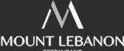

# Food and Drink

## Post ceremony nibbles
Prosecco and a non-alcoholic alternative will be served just after the ceremony, with nibbles to keep us going until a late lunch at 2pm. The venue has a liscensed pay bar that will be open for other alcoholic drinks, and tea, coffee and soft drinks will be available throughout the day. 

## Main meal
<!---->

The main meal will be a buffet lunch, served after the ceremony. It will be Lebanese cuisine, supplied by one our favourite restaurants, [Mount Lebanon](https://www.mountlebanon.co.uk/).

There will be wine with dinner, provided by the venue. 

### Menu
See the [Mount Lebanon menu](https://www.mountlebanon.co.uk/food-menu) for more details about any of the following dishes.

Starters/Mezza: Houmous, Moutabel (Baba Ghanoush), Falafel, Fattoush (salad --- crispy bread separate), (flat)bread, (stuffed vine leaves), Sambousek (assorted pastries --- choice of lamb, chicken or vegetarian), Batata Harra (delicious potato cubes).

Mains: Chicken leg, Meatballs (lamb), Moussaka (vegan), Yellow rice, White rice (contains egg noodle segments).

Dessert: Baklava, ice cream, [Scrumptious by Lucy](https://www.scrumptiousbylucy.com/) brownies.

## Dietary requirements

Proportions of meat, vegetarian and vegan options will be determined by responses to the [RSVP form](https://forms.google.com). Please let us know about any other dietary requirements, and we will make sure there is something tasty for you to eat.

## Evening food?
There won't be official evening food, but the buffet will stay out and Mount Lebanon are very generous with their portions. We don't anticipate there being any shortage of food! 